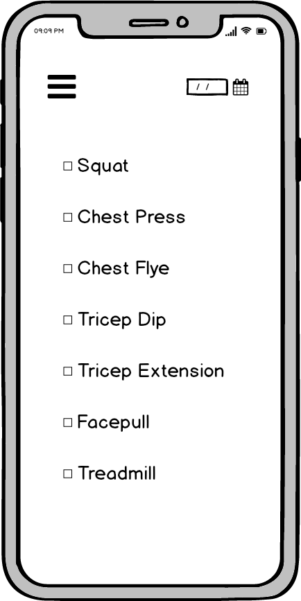
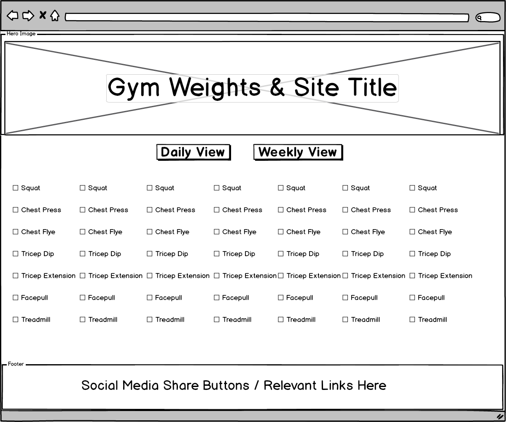

# Workout Planner

## Live deployment is available [here](https://workout-exercise-planner.herokuapp.com/)

Submission for Code Institute's Data-Centric Development Milestone Project, an application for the planning and logging of workout sessions.

## User Experience

### Target Audience

- People interested in planning their workouts.
- People who want to record their workouts in a list.
- People who want to view or follow others' exercise lists.

### Project Suitability

This project is a suitable way to deliver this content because:

- An authentication feature enables ownership of settings and objects.
- Selective permissions limit user interaction with exercises they are not the owner of, preventing unauthorised editing or removal of others' exercises.
- Users have the ability to create, view, edit or delete their own exercises, and ability to clone others' exercises to their own list.
- Users can "follow" other users, and display followed users' exercises in a filtered list.

## User Stories

1. As a new user I want to create an account.
2. As an established user I want to login to access my exercises.
3. As a logged-in user I want to create a new exercise.
4. As a logged-in user I want to edit one of my exercises.
5. As a logged-in user I want to delete one of my exercises.
6. As a logged-in user I want to clone another user's exercise.
7. As a logged-in user I want to mark my exercise as complete.

### User Story Fulfilment

1. 2.

## Design & Styling

### Colour Palette

The initial website design concepts have been formed with the following colour palette:  
 `#0f1011`  
 `#615F5B`  
 `#A2A29F`  
 `#FBFBFB`  
 `#2B5630`  
 `#04A647`

The chosen palette defines the site as a predominantly dark-themed design with lighter colours used to highlight / segment components.

## Wireframes

 Project Inception Wireframes 

Basic wireframes have been created upon project inception to aid in the planning stages of this project, these are to be adapted as the project proceeds with further iterations for multiple breakpoints.

#### Mobile Wireframe

#### Desktop Wireframe

## Features

### Existing Features

#### Feature 1

#### Feature 2

#### Feature 3

### Potential Features to Implement

The following are suggested additions that would exceed the project time constraints or require inaccessible resources but that would provide additional value to the project.

#### Feature 1

#### Feature 2

## Technologies Used

- HTML, CSS and Javascript programming languages are used for creating the core structure, styling and logic of this site.
- [jQuery](https://jquery.com/) is primarily used within this project for ease of DOM manipulation.
- [Bootstrap](https://getbootstrap.com) is used for resolution responsiveness and for general structuring of the UI.
- [Git](https://git-scm.com/) is used for the version control of this project.
- [Font Awesome](https://fontawesome.com/) provides the shuffle and information icons (used for both the welcome trigger and tooltips).
- [Google Fonts](https://fonts.google.com/) is used to supply the main font for the majority of this website, the font sourced in this way is ...

### Testing

Testing documentation is located in the [testing.md file.](./testing.md)

### Known Bugs & Limitations

Are there any features that don't perform as expected, is the discovery documented through testing section, are potential solutions noted?

## Deployment

This project was developed using Visual Studio Code, and was both committed to git and pushed to GitHub using the integrated source control feature.

The setup for the GitHub Pages deployment was as follows:

- Log into Github.
- Select the target repository from the list.
- Select "Settings" from the menu items.
- Scroll to the Github Pages section.
- Under "Source" click the drop-down that is set to "None" and select "Master Branch".
- The link to the website is now displayed under the "Github Pages" section.

At the time of submission are both the deployed and development versions of this project identical?

## Run this Project Locally:

## Credits

### Additional Resources

The main font applied to this site is: [Bebas Neue](https://fonts.google.com/specimen/Bebas+Neue)
The images used in this site were obtained from the following sources:

- [Geometric architecture image by Scott Webb, sourced from Pexels](https://www.pexels.com/photo/abstract-architecture-building-exterior-geometric-593158/)

### Acknowledgements

#### Disclaimer

This project and its contents are for educational purposes only.
